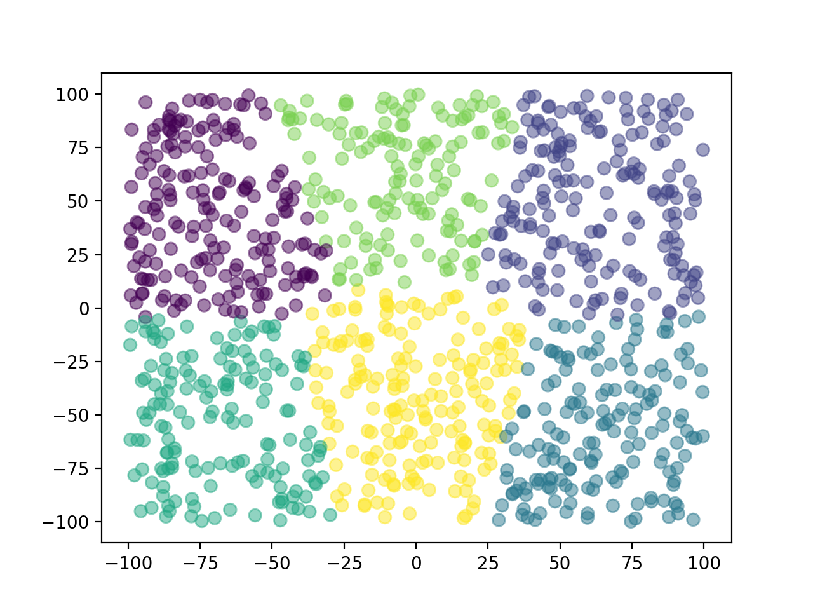
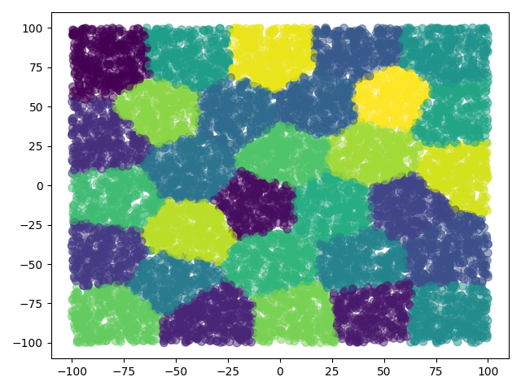
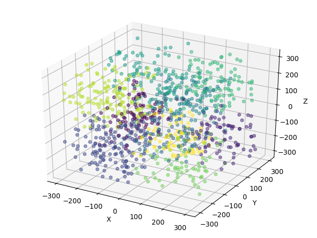
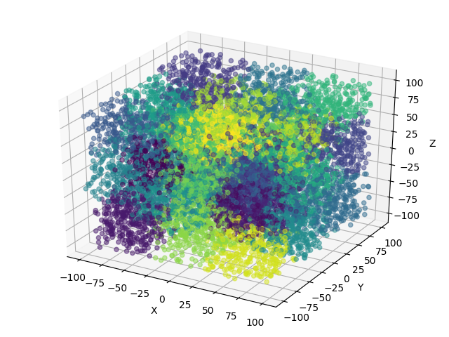

# ParallelComputing-kmeans-hadoop

The enlarging volumes of information emerging by the progress of technology, makes clustering of very large scale of data a challenging task. 

This [paper](https://github.com/LorenzoPratesi/ParallelComputing-kmeans-hadoop/blob/master/report/PC-kmeans-hadoop-report.pdf) presents a parallel k-means clustering algorithms based on Apache Hadoop MapReduce model which is a simple and powerful parallel programming technique. 

The tests were performed on intel i7 hexa core in a pseudo-distributed mode and then in a fully distributed mode with Amazon EMR. The results show that the proposed algorithm can scale well and efficiently process large datasets on commodity hardware.

## Usage
Generate the points for the data_set with the python script [generate_points.py](https://github.com/LorenzoPratesi/ParallelComputing-kmeans-hadoop/blob/master/generate_points.py)
(parameters, numPoints, range). 

The example below generates 5000 points where each point have 7 dimensions in range (-50, 50).
```
python generate_points.py 7 5000 50  
```

### Input dataset file
```
1,-47.10587172571255,14.943954356586303,-46.388420932704435,-44.85898057511504,14.692770405698909,8.554290548966762,-26.98274778248029
2,-32.14751308151169,-0.8911176341646865,-2.0721342259821895,24.350010927609574,-2.3325950902766976,45.28918282251456,-49.224569992743284
3,-47.591941681452674,5.468765865544512,5.8610799287109,-17.933096087609044,-30.09825602820945,35.48023571874454,9.63601787232966
4,48.44711307991986,-46.263696455513006,35.22224682081695,17.704512714415443,21.400883598731284,-17.60257644610158,-7.2307839109048615
5,-34.95815828915639,-1.7145665578178964,-44.719500095063545,35.051300048996254,-0.045665580754914004,13.08567798073446,-38.20550263636838
6,-46.186264882326725,12.786944713661526,-1.1674725772879526,-31.604073729884497,-42.84667412761787,1.0108232599687383,29.826072036677147
...
...
```

### Run kmeans clustering
Start clustering with hadoop by typing this command:

```
hadoop jar KMeansHadoop.jar PointsKMeans -i <IN> -o <OUT> -d <DIM> -k <CLUSTERS> [-e <EPS>]
```


#### Options description

```
[-i] stands for the input folder.
[-o] stands for the output folder.
[-d] stands for the number of dimensions of each data point 
[-k] stands for the number of clusters
[-e] stands for the tollerance of significant decimals to consider when comparing floats (optional, default value: 1e-3)
```  
#### Example 
```
hadoop jar KMeansHadoop.jar PointsKMeans -i INPUT_PATH -o OUTPUT_PATH -d 7 -k 6 -e 1e-8
```
Run kmeans on all the data file in INPUT_PATH and place the results in OUTPUT_PATH. 

The algorithm return the final centroids point based on:
- the dimension of each point that is 7
- the number of cluser that is 6
- the tollerance for stopping the iterations

Running the program will create in the output folder a file containing the coordinated of each centroid
### Output result file
```
0	-25.474,17.934,-9.333,-7.991,-1.379,21.269,-4.432
1	-17.7,-24.262,-12.361,1.163,5.73,-22.346,1.535
2	12.235,-22.147,19.466,3.453,-5.037,22.458,-2.773
3	3.215,18.707,23.649,8.259,-1.9,-21.397,-1.662
4	26.664,9.637,-25.983,-5.845,-0.004,3.174,8.597
```

## Visualizations
You can use [plot.py](https://github.com/LorenzoPratesi/ParallelComputing-kmeans-hadoop/blob/master/plot.py) to create some 2D or 3D plots.

Example with k = 6, 1000 2D points in range (-100; 100)
```
python generatePoints.py 2 1000 100
```


Example with k = 6, 10000 2D points in range (-100; 100)
```
python generatePoints.py 2 10000 100
```


Example with k = 10, 1000 3D points in range (-300; 300)
```
python generatePoints.py 3 1000 300
```



Example with k = 30, 10000 3D points in range (-100; 100)
```
python generatePoints.py 3 10000 100
```

